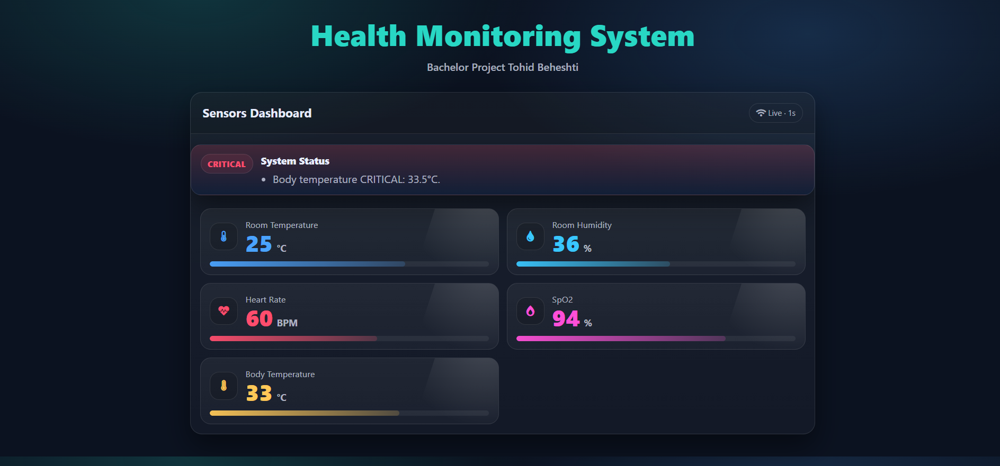

# Wearable IoT Health Monitoring System

### Real-Time Vital Sign Monitoring Using ESP32

A wearable IOT-based health monitoring system designed to measure vital signs in real time and display them through an embedded web dashboard.  
The system runs completely on an ESP32 microcontroller and does not rely on external cloud services.

## Overview

This project continuously monitors vital physiological and environmental parameters and presents them in a minimal web dashboard.

The system measures:

- Heart Rate (BPM)
- Blood oxygen Saturation (SpO₂)
- Body Temperature
- Room Temperature
- Room Humidity

All data are processed locally and send via an embedded web server hosted on the ESP32.

## System Architecture

The system consists of:

- **ESP32**: as the main controller and Wi-Fi interface  
- **MAX30100**: for Heart Rate and SpO₂  
- **DS18B20**: for Body Temperature  
- **DHT22**: for Room Temperature and Humidity  

The firmware follows a non-blocking architecture to ensure stable sampling and smooth Wi-Fi communication.

## Abnormality Detection

Each parameter is evaluated using defined thresholds and classified into:

- Normal
- Warning
- Critical
- Sensor Fault

The dashboard visually reflects the current state of the system.

## Hardware Schematic

Below is the Implemented circuit used in this project:

## Web Dashboard Preview

Real-time monitoring interface hosted directly on ESP32:

## Key Features

- Real-time vital sign acquisition  
- Embedded Web Server (no cloud dependency)  
- Wi-Fi based local monitoring  
- Threshold-based alarm system  
- Sensor fault detection  
- Modular and extendable design  

## How to Use

1. Install ESP32 board support in Arduino IDE  
2. Install required libraries  
3. Upload the `.ino` file to ESP32  
4. Open Serial Monitor to find device IP  
5. Access the dashboard via browser  

## Project Status

Final stable version – developed for academic and research purposes.

